<div align="center">

```
╔══════════════════════════════════════════════════════╗
║           MOHAMMAD ELIAS — BACKEND ENGINEER          ║
╚══════════════════════════════════════════════════════╝
```

**Crafting reliable, scalable server-side systems · Django · REST APIs · PostgreSQL**

[](https://linkedin.com/in/mohammad-elias)
[](https://leetcode.com/meliash198)
[](https://codeforces.com/profile/elias198)
[](https://www.codechef.com/users/meliash198)
[](https://www.hackerrank.com/@meliash198)
[](https://github.com/melias198)

</div>

---

## $ whoami

I'm a **Backend Engineer** with nearly 2 years of professional experience building production-grade web applications and APIs. My work centers on designing systems that are **maintainable, performant, and built to scale** — from data model design through deployment.

I specialize in the **Python/Django ecosystem**, with hands-on experience in RESTful API architecture, real-time features with Django Channels, async task processing with Celery, caching strategies, and relational database design. Outside of my main stack, I sharpen problem-solving skills through competitive programming.

```python
class BackendEngineer:
    name       = "Mohammad Elias"
    location   = "Chattogram, Bangladesh"
    experience = "~2 years (Backend Engineering)"
    focus      = ["API Design", "System Architecture", "Database Optimization"]
    stack      = {
        "languages":    ["Python", "C", "C++", "JavaScript"],
        "frameworks":   ["Django", "Django REST Framework", "Celery", "Django Channels"],
        "databases":    ["PostgreSQL", "MySQL"],
        "caching":      ["Redis", "Django Cache Framework"],
        "testing":      ["unittest", "pytest", "DRF APITestCase"],
        "devops":       ["Docker", "Git", "Linux", "Basic Deployment"],
        "tools":        ["VS Code", "Postman"],
        "frontend":     ["HTML5", "CSS3", "JavaScript"],
    }
    currently  = "Scalable APIs · System design · Competitive programming"
```

---

## ⚙️ Core Competencies

| Domain | Skills |
|---|---|
| **API Development** | RESTful API design, DRF serializers, viewsets, routers, filtering, pagination, versioning |
| **Async & Real-time** | Celery task queues, Celery Beat scheduling, Django Channels, WebSockets |
| **Authentication** | JWT, session auth, token refresh flows, OAuth2, permission & throttling classes |
| **Database** | Schema design, query optimization, indexing, ORM proficiency, raw SQL, migrations |
| **Caching** | Redis-backed caching, cache invalidation strategies, Django cache framework |
| **Testing** | Unit tests, integration tests, API tests with DRF APITestCase & pytest |
| **DevOps** | Docker, Git workflows, Linux server basics, environment & config management |
| **Problem Solving** | Data structures & algorithms, competitive programming (Codeforces, LeetCode) |

---

## 🛠 Tech Stack

**Backend**


**Databases**


**Languages**


**DevOps & Tools**


---

## 📊 GitHub Stats

<!-- Stats cards are auto-generated daily by GitHub Actions and stored in /profile/ -->
<div align="center">
  
  
</div>

<div align="center">
  
</div>

---

## 🏆 Competitive Programming

<div align="center">
  
  
</div>

> Consistent participant on **Codeforces**, **LeetCode**, and **CodeChef** — competitive programming directly informs how I approach algorithmic challenges and backend performance problems in production.

---

## 📌 What I'm Working On

- 🔨 Building production-ready backend systems with **Django, DRF, Celery & Channels**
- 📐 Deepening knowledge of **system design** — scalability, message queues, microservices
- 🧪 Writing comprehensive **test suites** and improving code quality practices
- ☁️ Expanding **Docker & deployment** skills toward a cloud-proficient engineering profile

---

## 🤝 Open To

- Collaborating on **backend-heavy open-source projects**
- Contributing to **SaaS platforms** and API-driven products
- Discussing **backend architecture, API design, or Django best practices**

**Reach me:** [LinkedIn](https://linkedin.com/in/mohammad-elias) · Open a GitHub issue or discussion on any of my repos

---

<div align="center">
  <sub><em>"First, solve the problem. Then, write the code." — John Johnson</em></sub>
</div>